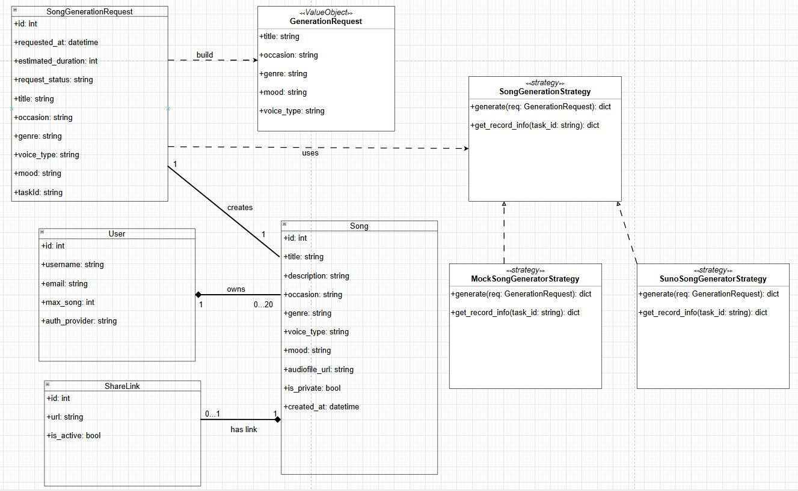
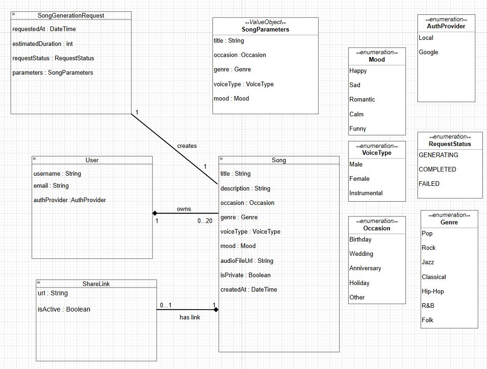
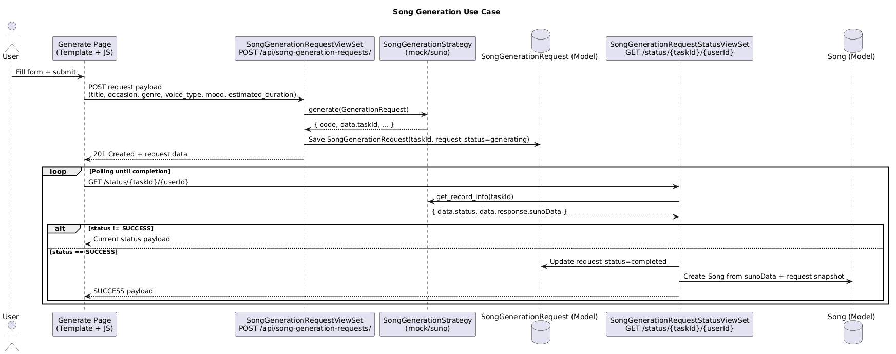
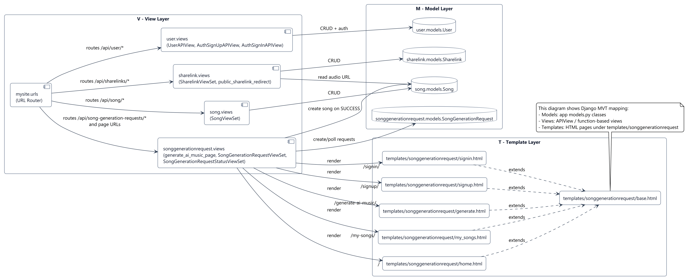

# Cithai Django – Domain Layer & Song Generation

A Django-based domain layer for Cithai, including **Exercise 4** song generation via the **Strategy pattern** (mock vs Suno API).

---

## Project Setup

### Requirements
- Python 3.10+
- pip

### Installation

```bash
# Clone the repository
git clone <your-repo-url>
cd cithai-django

# Create local environment file for mac
cp .env.example .env

#Create local environment file for window
copy .env.example .env

# Install requirements
pip install -r requirements.txt

# Apply migrations
python manage.py migrate

# Create a superuser (for Admin CRUD)
python manage.py createsuperuser

# Run the development server
python manage.py runserver
```

Visit `http://127.0.0.1:8000/` for the web UI and `http://127.0.0.1:8000/admin/` for Django Admin.

---

## Song generation strategies (Exercise 4)

Generation is implemented with a shared **`SongGenerationStrategy`** interface (`generate` + `get_record_info`) and two implementations:

| Strategy | Module | Behavior |
|----------|--------|----------|
| **mock** | `songgenerationrequest.generation.mock` | No network; fixed `taskId` and immediate `SUCCESS` record-info |
| **suno** | `songgenerationrequest.generation.suno` | `POST https://api.sunoapi.org/api/v1/generate` and `GET .../generate/record-info` with `Authorization: Bearer …` |

Active strategy is chosen in **one place**: `get_song_generation_strategy()` in `songgenerationrequest/generation/factory.py`, driven by Django settings from the environment.

### Configure `.env` (do not commit secrets)

Copy `.env.example` to `.env` and set:

- **`GENERATOR_STRATEGY`**: `mock` (default) or `suno`
- **`SUNO_API_KEY`**: your Bearer token from Suno — **required only when** `GENERATOR_STRATEGY=suno`

### Run in mock mode (offline) — step by step

Mock mode is for **local development**: no `SUNO_API_KEY`, no calls to Suno. The server uses `MockSongGeneratorStrategy` (`songgenerationrequest/generation/mock.py`), which always returns the same `taskId` and a fake `SUCCESS` payload (including a sample `audioUrl`).

#### 1. Turn mock on

In `.env` (copy from `.env.example` if needed):

```bash
GENERATOR_STRATEGY=mock
```

Restart `runserver` after changing `.env` so Django reloads settings.

#### 2. Know your `userId`

The status URL needs the **numeric primary key** of a `User` who should own the new `Song`.

- After `createsuperuser`, open **Admin → Users** and note that user’s **ID**, or  
- List users: `GET http://127.0.0.1:8000/api/user/`

Use that integer as `userId` below (example: `1`).

#### 3. Create a generation request (`POST`)

`POST http://127.0.0.1:8000/api/song-generation-requests/`  
Content-Type: `application/json`

Required / typical body (see `song/enums.py` for allowed values):

```json
{
  "estimated_duration": 60,
  "title": "Birthday demo",
  "occasion": "birthday",
  "genre": "classical",
  "voice_type": "male",
  "mood": "calm"
}
```

- **`estimated_duration`**: required integer (seconds estimate).  
- **`occasion`**: `birthday` | `wedding` | `anniversary` | `holiday` | `other`  
- **`genre`**: `pop` | `rock` | `jazz` | `classical` | `hiphop` | `rb` | `folk`  
- **`voice_type`**: `male` | `female` | `instrumental`  
- **`mood`**: `happy` | `sad` | `romantic` | `calm` | `funny`  

On success (`201`), the response includes a fixed mock **`taskId`**:

`mock-task-00000000-0000-4000-8000-000000000001`

#### 4. Poll status once (`GET`) — creates the `Song`

`GET http://127.0.0.1:8000/api/song-generation-requests/status/<taskId>/<userId>`

Example (replace `1` with your real user id):

```text
GET http://127.0.0.1:8000/api/song-generation-requests/status/mock-task-00000000-0000-4000-8000-000000000001/1
```

When `data.status` is `SUCCESS`, the view marks the `SongGenerationRequest` completed and **creates a `Song`** for that `userId` using the mock Suno-shaped payload (title, tags, audio URL, etc.). You can confirm in Admin or with `GET /api/song/`.

**Note:** Mock `get_record_info` only accepts that **exact** `taskId`. Any other id returns `404` with `mock: unknown taskId`.

#### 5. Optional: `curl` (bash)

```bash
curl -s -X POST http://127.0.0.1:8000/api/song-generation-requests/ \
  -H "Content-Type: application/json" \
  -d '{"estimated_duration":60,"title":"Birthday demo","occasion":"birthday","genre":"classical","voice_type":"male","mood":"calm"}'

curl -s "http://127.0.0.1:8000/api/song-generation-requests/status/mock-task-00000000-0000-4000-8000-000000000001/1"
```

### Run in Suno mode

```bash
# .env
GENERATOR_STRATEGY=suno
SUNO_API_KEY=your_token_here
```

Same API paths: `POST` creates a real task (`taskId` from Suno); `GET status/...` calls record-info until `status` is `SUCCESS` (or returns current Suno payload).

### Minimal demo checklist

- **Mock**: `POST` then `GET status` with the returned mock `taskId` — no API key, no outbound HTTP for generation.
- **Suno**: `POST` shows a real `taskId`; `GET status` returns Suno record-info (may be `PENDING` / `TEXT_SUCCESS` / … until `SUCCESS`).

---

## Domain Model

The project implements four core domain entities:

### `User` (app: `user`)
Extends Django's built-in `AbstractUser` with:
- `max_song` — quota of songs a user can generate (default: 20)
- `auth_provider` — login method: `local` or `google`

### `Song` (app: `song`)
The central domain entity representing a generated song:
- `title`, `description`
- `occasion` — birthday, wedding, anniversary, holiday, other
- `genre` — pop, rock, jazz, classical, hiphop, rb, folk
- `voice_type` — male, female, instrumental
- `mood` — happy, sad, romantic, calm, funny
- `audiofile_url` — URL to the generated audio file (blank while generating)
- `is_private` — visibility control
- `created_at` — timestamp

**Relationships:**
- Many `Song`s belong to one `User` (ForeignKey)

### `SongGenerationRequest` (app: `songgenerationrequest`)
Tracks the AI generation job for each song:
- `title`, `occasion`, `genre`, `voice_type`, `mood` — snapshot of what was requested
- `taskId` — external generation task id
- `request_status` — generating / completed / failed
- `estimated_duration` — estimated generation time in seconds
- `requested_at` — timestamp

### `Sharelink` (app: `sharelink`)
A shareable link for a completed song:
- `song` — OneToOne link to `Song`
- `url` — app-controlled public share URL (`/api/sharelinks/public/{id}/`)
- `is_active` — whether the link is currently active

When `is_active = false`, opening the public share URL returns `404` (disabled).  
When `is_active = true`, the URL redirects to the song audio file.

## UML Diagrams

To keep design artifacts synchronized with code, this repository includes:

- Class diagram: `docs/diagrams/class-diagram.png`
- Domain model diagram: `docs/diagrams/domain-model.png`
- Sequence diagram (song generation flow): `docs/diagrams/sequence-diagram.png`
- MVT architecture diagram: `docs/diagrams/mvt-architecture.png`

### Class Diagram


### Domain Model Diagram


### Sequence Diagram


### MVT Architecture Diagram


---

## CRUD Operations

All CRUD operations are available through **Django Admin** at `/admin/`.

### How to demonstrate CRUD:

1. Run the server and log in at `http://127.0.0.1:8000/admin/`
2. Navigate to any entity (Users, Songs, Song Generation Requests, Sharelinks)

| Operation | How to perform |
|-----------|---------------|
| **Create** | Click "Add" button on any model list page |
| **Read**   | Click any record to view its details |
| **Update** | Open a record and modify fields, then Save |
| **Delete** | Select records and use the "Delete selected" action, or open a record and click Delete |

### Suggested demo flow:
1. **Create** a User (Admin → Users → Add User)
2. **Create** a Song assigned to that user (Admin → Songs → Add Song)
3. **Create** a SongGenerationRequest
4. **Create** a Sharelink for the song
5. **Update** Song fields (e.g. `title` or `is_private`)
6. **Delete** the Sharelink to demonstrate deletion cascading

---

## Database

SQLite (default Django setup). The schema is fully defined by migrations in each app's `migrations/` folder.

---

## API Endpoints

Run the server and visit the links below in your browser to test CRUD via the DRF browsable API.

| Method | URL | Operation |
|--------|-----|-----------|
| GET / POST | `/api/song/` | Song list / create |
| GET / PUT / DELETE | `/api/song/{id}/` | Song read / update / delete |
| GET / POST | `/api/user/` | User list / create |
| GET / PUT / DELETE | `/api/user/{id}/` | User read / update / delete |
| POST | `/api/user/auth/signup/` | User sign up (requires `username`, `email`, `password`) |
| POST | `/api/user/auth/signin/` | User sign in (supports `username` + `password`; `email` + `password` also supported) |
| GET / POST | `/api/song-generation-requests/` | Request list / create (uses `GENERATOR_STRATEGY`) |
| GET / PUT / DELETE | `/api/song-generation-requests/{id}/` | Request read / update / delete |
| GET | `/api/song-generation-requests/status/{taskId}/{userId}` | Poll record-info; on `SUCCESS`, completes request and creates `Song` |
| GET / POST | `/api/sharelinks/` | Sharelink list / create |
| GET / PUT / DELETE | `/api/sharelinks/{id}/` | Sharelink read / update / delete |
| GET | `/api/sharelinks/public/{id}/` | Public share URL (only when `is_active=true`) |

### Auth request examples

Sign up:

```json
{
  "username": "demo_user",
  "email": "demo@example.com",
  "password": "secret123"
}
```

Sign in (recommended):

```json
{
  "username": "demo_user",
  "password": "secret123"
}
```

## Frontend Notes (My Songs)

`/my-songs/` currently supports:

- Play songs inline using the bottom audio player
- Toggle share status per song (`Share: ON/OFF`)
- Copy share URL to clipboard when share is enabled
- Delete song with a custom confirm modal UI (not browser `window.confirm`)

## Frontend Routes

- `/` - Home page
- `/signin/` - Sign in page
- `/signup/` - Sign up page
- `/generate-ai-music/` - Song generation page
- `/my-songs/` - Song list/player/share/delete page

## Project Structure

```
cithai-django/
├── mysite/              # Project config (settings, urls)
├── user/                # User domain entity
├── song/                # Song domain entity
├── songgenerationrequest/  # Generation job tracking
├── sharelink/           # Share link entity
├── templates/           # HTML templates (UI pages)
├── docs/
│   └── diagrams/        # UML/domain/sequence/MVT diagrams
├── db.sqlite3           # SQLite database
└── manage.py
```